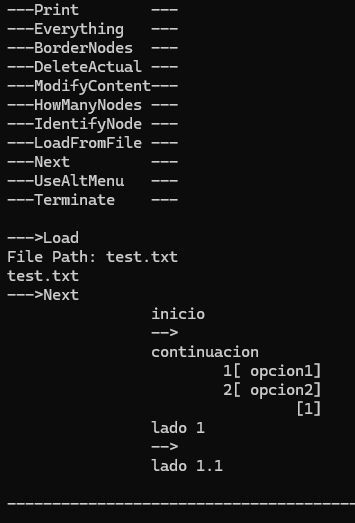

### Temporary placeholder for documentation.
## RUN
#### Run proyect Cmake Commands (gcc)
```
mkdir build    
cd build
cmake ..
cmake --build .
```

## USSAGE

#### Use of alt menu recomended

Alt menu all options
```
A[test1]
A --> B[test2]
A -[label1]-> C[test3]
B -[label2]-> B
D
D --> E
F[test4] --> G
G -[label3]-> H[test con espacios]
start
```
File input
(files must be along side the .exe)

test2.txt example (alt menu test)
```
UseAltMenu
A[inicio] --> A1[continuacion]
A1 -[opcion1]-> B[lado 1]
B --> B1[lado 1.1]
A1 -[opcion2]-> C[lado2]
start
```

test.txt example (first menu test)
```
add
inicio
add
continuacion
add
lado 1
add
lado 1.1
add
lado 2
goto
0
connect

1
goto
1
connect
opcion1
2
connect
opcion2
4
goto
2
connect

3
z
```
expected possible path for both tests

